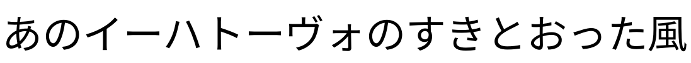

# インクリメンタルレンダリング

cappan のインクリメンタルレンダリング（テキストアニメーション）のサンプル集です。各サンプルには生成に使用したコマンドを併記しています。

すべてのサンプルは以下の共通オプションで生成しています。

```sh
FONT="cappan_doc/asset/font/NotoSansCJKjp-Regular.otf"
TEXT="あのイーハトーヴォのすきとおった風"
```

---

## medial-axis（中心軸 + ブラシ）

グリフの骨格線（中心軸）を抽出し、その経路に沿ってブラシで描くようにストロークを表示します。手書きのような自然な描画順になります。

### 中心軸 × 逐次表示


```sh
cappan animate --font $FONT --text "$TEXT" --size 64 --frames 144 --fps 24 --hold 24 \
  --strategy medial-axis --timing sequential \
  --output medial_axis_seq.png
```

### 中心軸 × 同時表示


```sh
cappan animate --font $FONT --text "$TEXT" --size 64 --frames 144 --fps 24 --hold 24 \
  --strategy medial-axis --timing simultaneous \
  --output medial_axis_sim.png
```

### 中心軸 × writing-order × 逐次表示


```sh
cappan animate --font $FONT --text "$TEXT" --size 64 --frames 144 --fps 24 --hold 24 \
  --strategy medial-axis --contour-ordering writing-order --timing sequential \
  --output medial_axis_writing.png
```

### 中心軸 × writing-order × weighted


```sh
cappan animate --font $FONT --text "$TEXT" --size 64 --frames 144 --fps 24 --hold 24 \
  --strategy medial-axis --contour-ordering writing-order --timing weighted \
  --output medial_axis_writing_weighted.png
```

---

## contour-trace（輪郭トレース）

グリフの輪郭線をなぞるように描画します。`--contour-ordering` で描画順序を変えることで、筆順風やサイズ優先など様々な表現が可能です。

### font-order × 逐次表示


```sh
cappan animate --font $FONT --text "$TEXT" --size 64 --frames 144 --fps 24 --hold 24 \
  --strategy contour-trace --contour-ordering font-order --timing sequential \
  --output contour_font_seq.png
```

### stroke-heuristic × 逐次表示


```sh
cappan animate --font $FONT --text "$TEXT" --size 64 --frames 144 --fps 24 --hold 24 \
  --strategy contour-trace --contour-ordering stroke-heuristic --timing sequential \
  --output contour_stroke_seq.png
```

### area-priority × 逐次表示


```sh
cappan animate --font $FONT --text "$TEXT" --size 64 --frames 144 --fps 24 --hold 24 \
  --strategy contour-trace --contour-ordering area-priority --timing sequential \
  --output contour_area_seq.png
```

### writing-order × 逐次表示


```sh
cappan animate --font $FONT --text "$TEXT" --size 64 --frames 144 --fps 24 --hold 24 \
  --strategy contour-trace --contour-ordering writing-order --timing sequential \
  --output contour_writing_seq.png
```

### writing-order × weighted


```sh
cappan animate --font $FONT --text "$TEXT" --size 64 --frames 144 --fps 24 --hold 24 \
  --strategy contour-trace --contour-ordering writing-order --timing weighted \
  --output contour_writing_weighted.png
```

---

## sweep（スウィープ）

指定方向にスウィープライン（走査線）を移動させ、通過した部分から表示します。シンプルで汎用的なストラテジーです。

### 左から右 × 逐次表示


```sh
cappan animate --font $FONT --text "$TEXT" --size 64 --frames 144 --fps 24 --hold 24 \
  --strategy sweep --sweep-direction left-to-right --timing sequential \
  --output sweep_ltr_seq.png
```

### 左から右 × 同時表示


```sh
cappan animate --font $FONT --text "$TEXT" --size 64 --frames 144 --fps 24 --hold 24 \
  --strategy sweep --sweep-direction left-to-right --timing simultaneous \
  --output sweep_ltr_sim.png
```

### 上から下 × 逐次表示


```sh
cappan animate --font $FONT --text "$TEXT" --size 64 --frames 144 --fps 24 --hold 24 \
  --strategy sweep --sweep-direction top-to-bottom --timing sequential \
  --output sweep_ttb_seq.png
```

### 左から右 × overlap:0.3


```sh
cappan animate --font $FONT --text "$TEXT" --size 64 --frames 144 --fps 24 --hold 24 \
  --strategy sweep --timing "overlap:0.3" \
  --output sweep_ltr_overlap03.png
```

### 左から右 × overlap:0.7


```sh
cappan animate --font $FONT --text "$TEXT" --size 64 --frames 144 --fps 24 --hold 24 \
  --strategy sweep --timing "overlap:0.7" \
  --output sweep_ltr_overlap07.png
```

---

## distance-field（ディスタンスフィールド）

距離場を利用し、グリフの内部（中心）から輪郭に向かって膨張するように表示します。文字が内側から湧き出るような効果になります。

### ディスタンスフィールド × 逐次表示


```sh
cappan animate --font $FONT --text "$TEXT" --size 64 --frames 144 --fps 24 --hold 24 \
  --strategy distance-field --timing sequential \
  --output distance_field_seq.png
```

### ディスタンスフィールド × 同時表示


```sh
cappan animate --font $FONT --text "$TEXT" --size 64 --frames 144 --fps 24 --hold 24 \
  --strategy distance-field --timing simultaneous \
  --output distance_field_sim.png
```

---

## extrema-wave（エクストリーマウェーブ）

アウトラインの極値点（最上・最下・最左・最右や方向転換点）から波紋のように広がって表示します。`--extrema-invert` で反転すると、極値点から遠い内部が先に現れます。

### エクストリーマウェーブ × 逐次表示


```sh
cappan animate --font $FONT --text "$TEXT" --size 64 --frames 144 --fps 24 --hold 24 \
  --strategy extrema-wave --timing sequential \
  --output extrema_wave_seq.png
```

### エクストリーマウェーブ × 同時表示


```sh
cappan animate --font $FONT --text "$TEXT" --size 64 --frames 144 --fps 24 --hold 24 \
  --strategy extrema-wave --timing simultaneous \
  --output extrema_wave_sim.png
```

### エクストリーマウェーブ × 極値点から × 逐次表示


```sh
cappan animate --font $FONT --text "$TEXT" --size 64 --frames 144 --fps 24 --hold 24 \
  --strategy extrema-wave --extrema-invert --timing sequential \
  --output extrema_wave_inv_seq.png
```

### エクストリーマウェーブ × 極値点から × 同時表示


```sh
cappan animate --font $FONT --text "$TEXT" --size 64 --frames 144 --fps 24 --hold 24 \
  --strategy extrema-wave --extrema-invert --timing simultaneous \
  --output extrema_wave_inv_sim.png
```

---

## fade（フェード）

グリフ全体を均一にフェードインして表示します。ピクセル単位の空間的な変化はなく、透明度だけが時間とともに上がります。

### フェード × 逐次表示


```sh
cappan animate --font $FONT --text "$TEXT" --size 64 --frames 144 --fps 24 --hold 24 \
  --strategy fade --timing sequential \
  --output fade_seq.png
```

### フェード × 同時表示


```sh
cappan animate --font $FONT --text "$TEXT" --size 64 --frames 144 --fps 24 --hold 24 \
  --strategy fade --timing simultaneous \
  --output fade_sim.png
```

---

## skeleton-grow（スケルトングロウ）

骨格線（中心軸）から外側に向かって肉付けするように表示します。distance-field が中心から広がるのに対し、こちらは細い骨格が先に現れてから太くなっていきます。

### スケルトングロウ × 逐次表示


```sh
cappan animate --font $FONT --text "$TEXT" --size 64 --frames 144 --fps 24 --hold 24 \
  --strategy skeleton-grow --timing sequential \
  --output skeleton_grow_seq.png
```

### スケルトングロウ × 同時表示


```sh
cappan animate --font $FONT --text "$TEXT" --size 64 --frames 144 --fps 24 --hold 24 \
  --strategy skeleton-grow --timing simultaneous \
  --output skeleton_grow_sim.png
```

### スケルトングロウ × weighted


```sh
cappan animate --font $FONT --text "$TEXT" --size 64 --frames 144 --fps 24 --hold 24 \
  --strategy skeleton-grow --timing weighted \
  --output skeleton_grow_weighted.png
```

---

## tangent-flow（タンジェントフロー）

アウトラインの接線方向でピクセルをグループ化し、方向別に表示します。水平ストロークが最初に現れ、次に垂直、最後に斜めの部分が表示されます。

### タンジェントフロー × 逐次表示


```sh
cappan animate --font $FONT --text "$TEXT" --size 64 --frames 144 --fps 24 --hold 24 \
  --strategy tangent-flow --timing sequential \
  --output tangent_flow_seq.png
```

### タンジェントフロー × 同時表示


```sh
cappan animate --font $FONT --text "$TEXT" --size 64 --frames 144 --fps 24 --hold 24 \
  --strategy tangent-flow --timing simultaneous \
  --output tangent_flow_sim.png
```

---

## easing（イージング）

グリフごとの進捗にイージング関数を適用します。等速ではなく、加速・減速のある自然な動きになります。任意のストラテジーと組み合わせ可能です。

### sweep × ease-in-out × 逐次表示


```sh
cappan animate --font $FONT --text "$TEXT" --size 64 --frames 144 --fps 24 --hold 24 \
  --strategy sweep --timing sequential --easing ease-in-out \
  --output sweep_easeio_seq.png
```

---

## reverse（逆再生）

`--reverse` を指定すると progress が 1.0 → 0.0 の逆方向に進行します。任意のストラテジーと組み合わせ可能で、描画が消えていくようなアニメーションになります。

### contour-trace writing-order × 逐次表示 × 逆再生



```sh
cappan animate --font $FONT --text "$TEXT" --size 64 --frames 144 --fps 24 --hold 24 \
  --strategy contour-trace --contour-ordering writing-order --timing sequential --reverse \
  --output contour_writing_rev.png
```
